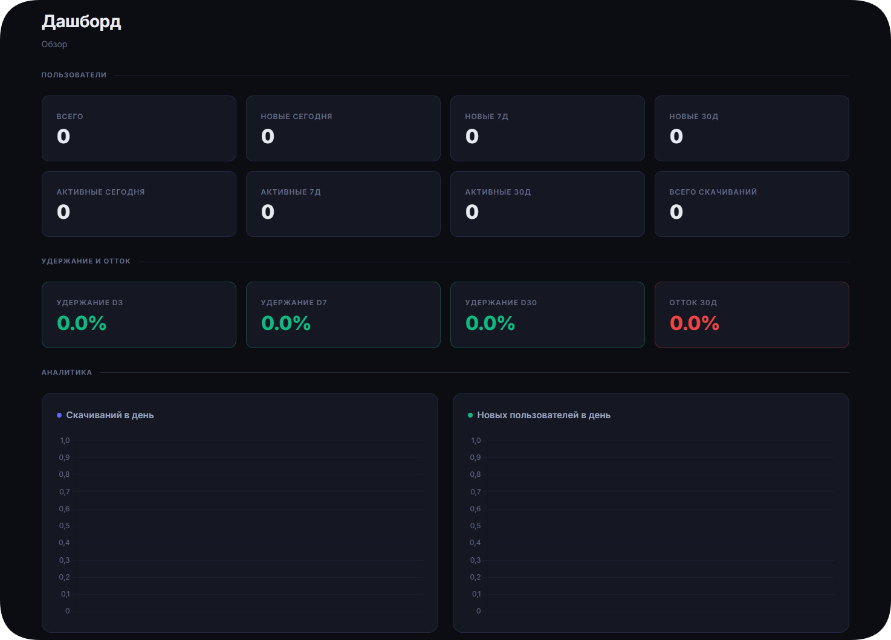

<p align="center">
  
</p>

<h1 align="center">Nuvio</h1>

<p align="center">
  Telegram-бот для скачивания видео с YouTube, TikTok и Instagram<br>
  с поддержкой кэширования, аналитики и автоматического обновления yt-dlp.
</p>

---

## Возможности

- YouTube (видео + Shorts), TikTok, Instagram (посты, reels)
- Извлечение аудио (MP3 192k через FFmpeg)
- Кэширование file_id -- мгновенная повторная отправка через Telegram CDN
- Файлы >50MB загружаются на Gokapi и отправляются ссылкой
- Защита от спама (4 запроса за 5 секунд = cooldown 10 секунд)
- Админские команды: `/cache_stats`, `/search_cache`, `/cleanup_cache`, `/admin` (управление cookies)
- WebUI-дашборд аналитики (FastAPI + Jinja2)
- Автообновление yt-dlp (rolling-release, nightly channel)
- Готовность к headless/systemd-развертыванию (`init_env.sh` в качестве `ExecStartPre`)
- Поддержка Docker

## Скриншот

<p align="center">
  
</p>

---

## Быстрый старт

### Требования

- Python 3.13+
- FFmpeg
- Токен Telegram-бота ([@BotFather](https://t.me/BotFather))

### Установка

```bash
git clone https://github.com/mazixs/Nuvio.git
cd Nuvio
pip install -r requirements.txt
```

Скопируйте `.env.example` в `.secrets/.env` и заполните `TELEGRAM_TOKEN` и `ADMIN_IDS`:

```bash
mkdir -p .secrets
cp .env.example .secrets/.env
# отредактируйте .secrets/.env
python main.py
```

### Docker

```bash
cp .env.example .env
# Отредактируйте .env — укажите TELEGRAM_TOKEN, ADMIN_IDS, WEB_PASSWORD и WEB_PORT

# Локальная сборка
docker compose up --build

# Или из GHCR по версии (продакшен)
TAG=1.0.0 docker compose -f docker-compose.prod.yml up -d
```

Дашборд будет доступен на `http://localhost:<WEB_PORT>` (по умолчанию 8080).

Подробная настройка Docker (порты, пароли, volumes, cookies) — в [`docs/guides/deployment.md`](docs/guides/deployment.md#docker).

---

## CI/CD

- **CI** — автоматические тесты и линтинг на каждый push/PR в `main`
- **Релиз** — при пуше тега `v*` автоматически:
  - Прогоняются тесты
  - Генерируется changelog из коммитов
  - Создаётся GitHub Release с инструкцией по установке
  - Собирается Docker-образ и пушится в GHCR с тегами версий

Создание нового релиза:

```bash
git tag v1.0.0
git push origin v1.0.0
```

---

## Конфигурация

| Переменная | Обязательная | По умолчанию | Описание |
|---|---|---|---|
| `TELEGRAM_TOKEN` | да | -- | Токен бота от @BotFather |
| `ADMIN_IDS` | да | -- | Список ID администраторов через запятую |
| `GOKAPI_API_KEY` | нет | -- | API-ключ для Gokapi (отправка файлов >50MB) |
| `GOKAPI_BASE_URL` | нет | -- | Базовый URL сервера Gokapi |
| `WEB_USERNAME` | нет | -- | Логин для WebUI-дашборда |
| `WEB_PASSWORD` | нет | -- | Пароль для WebUI-дашборда |
| `WEB_SECRET_KEY` | нет | -- | Секретный ключ для сессий WebUI |
| `WEB_PORT` | нет | -- | Порт WebUI-дашборда |
| `LOG_LEVEL` | нет | `INFO` | Уровень логирования |
| `DOWNLOAD_WORKERS` | нет | `8` | Количество потоков в ThreadPoolExecutor |
| `BLOCKING_TASK_TIMEOUT` | нет | `600` | Таймаут блокирующих задач (секунды) |
| `YTDLP_AUTO_UPDATE` | нет | -- | Автообновление yt-dlp при старте |
| `YTDLP_RELEASE_CHANNEL` | нет | -- | Канал обновлений yt-dlp (stable/nightly) |
| `YTDLP_AUTO_UPDATE_TIMEOUT` | нет | -- | Таймаут операции обновления yt-dlp (секунды) |
| `YTDLP_CLI_FALLBACK` | нет | -- | Использовать CLI-режим yt-dlp как fallback |
| `YTDLP_CLI_TIMEOUT` | нет | -- | Таймаут CLI-вызова yt-dlp (секунды) |

---

## Команды бота

| Команда | Описание | Доступ |
|---|---|---|
| `/start` | Приветственное сообщение и краткая справка | Все пользователи |
| `/help` | Подробная справка по использованию бота | Все пользователи |
| `/download <URL>` | Скачать видео по ссылке (необязательна -- достаточно отправить ссылку) | Все пользователи |
| `/admin` | Панель администратора (управление cookies) | Администраторы |
| `/cache_stats` | Статистика кэша file_id | Администраторы |
| `/cleanup_cache` | Очистка устаревших записей кэша | Администраторы |
| `/search_cache` | Поиск по кэшу file_id | Администраторы |

---

## Структура проекта

```
Nuvio/
├── main.py
├── config.py
├── messages.py
├── utils/
│   ├── telegram_utils.py
│   ├── youtube_utils.py
│   ├── tiktok_instagram_utils.py
│   ├── media_processor.py
│   ├── video_cache.py
│   ├── analytics_db.py
│   ├── ytdlp_runtime.py
│   ├── gokapi_utils.py
│   ├── cookie_manager.py
│   ├── cookie_health.py
│   ├── logger.py
│   ├── cache_commands.py
│   └── temp_file_manager.py
├── web/
│   ├── app.py
│   ├── templates/
│   └── static/
├── tests/
├── docs/
├── .secrets/
├── .github/workflows/       # CI/CD (тесты, линтинг, релиз, GHCR)
├── Dockerfile
├── docker-compose.yml       # для локальной разработки
├── docker-compose.prod.yml  # production — тянет из GHCR
└── requirements.txt
```

| Модуль | Назначение |
|---|---|
| `main.py` | Точка входа: async event-loop, graceful shutdown, scheduled tasks |
| `config.py` | Парсинг переменных окружения с типизацией, пути к секретам |
| `messages.py` | Все пользовательские тексты и сообщения бота |
| `telegram_utils.py` | Хэндлеры бота: команды, callback-кнопки, обработка URL, отправка файлов |
| `youtube_utils.py` | Загрузка YouTube/Shorts через yt-dlp с cookie-поддержкой и smart retry |
| `tiktok_instagram_utils.py` | TikTok (множественные API-хосты, exponential backoff) и Instagram (rate-limit aware) |
| `media_processor.py` | FFmpeg: извлечение аудио, конвертация WebM в MP4, мерж аудио/видео |
| `video_cache.py` | SQLite-кэш file_id для мгновенной повторной отправки (WAL mode, TTL 90 дней) |
| `analytics_db.py` | SQLite-аналитика: таблицы users, events (WAL mode) |
| `ytdlp_runtime.py` | Автообновление yt-dlp, CLI fallback |
| `gokapi_utils.py` | Загрузка файлов >50MB на Gokapi (multipart, API key) |
| `cookie_manager.py` | Админский интерфейс загрузки cookies |
| `cookie_health.py` | Валидация и проверка здоровья cookies |
| `logger.py` | Настройка логирования (rotating file handler, 10MB, 5 backups) |
| `cache_commands.py` | Обработчики админских команд для управления кэшем |
| `temp_file_manager.py` | Управление временными файлами при скачивании |
| `web/app.py` | FastAPI-приложение: логин, дашборд, список и детали пользователей |

---

## Тестирование

```bash
pytest                              # все тесты
pytest tests/test_youtube_smoke.py -v  # один файл с подробным выводом
pytest --run-slow                   # включить медленные тесты
pytest --run-network                # включить сетевые тесты
pytest -k "test_name"               # запуск конкретного теста
```

Маркеры: `syntax`, `unit`, `integration`, `slow`. Тесты YouTube используют мокированный YoutubeDL (без сетевых запросов). Системные зависимости для тестов: FFmpeg, git.

---

## Документация

Подробная документация находится в директории [`docs/`](docs/):

- Архитектура проекта
- Руководство по развертыванию
- Справочник по конфигурации
- Устранение неполадок
- Коды ошибок

---

## Лицензия

Условия лицензирования указаны в файле [LICENSE](LICENSE).
