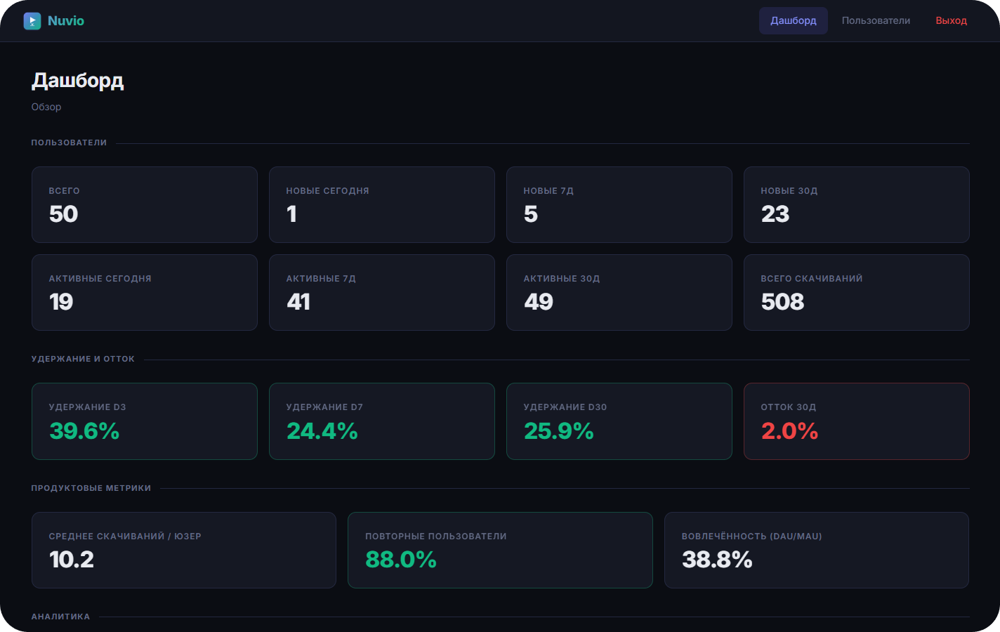
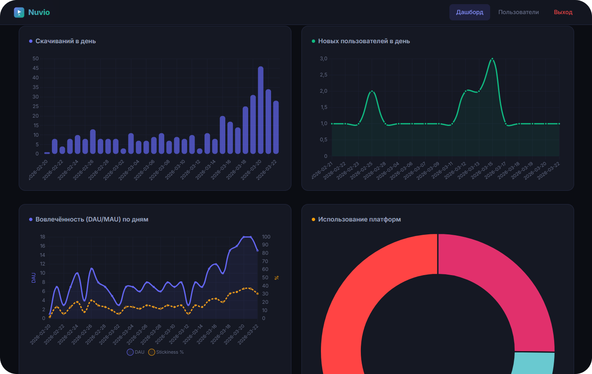
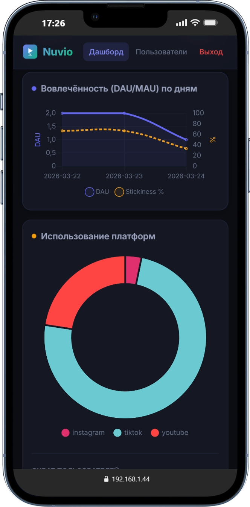

<p align="center">
  
</p>

<h1 align="center">Nuvio</h1>

<p align="center">
  Telegram-бот для скачивания видео, фото-постов и аудио с YouTube, TikTok, Instagram, Rutube и VK Video<br>
  с поддержкой кэширования, аналитики и автоматического обновления yt-dlp.
</p>

---

## Возможности

- YouTube (видео + Shorts), TikTok, Instagram (посты, reels, фото-посты, карусели), Rutube, VK Video
- TikTok и Instagram фото-посты: каждая картинка отправляется отдельным сообщением, звук — отдельно, если он есть
- Извлечение аудио (MP3 192k через FFmpeg для видео и отдельная звуковая дорожка для фото-постов)
- Кэширование file_id -- мгновенная повторная отправка через Telegram CDN
- Файлы до 2 ГБ отправляются через локальный Telegram Bot API
- Загруженные медиа удаляются после отправки; постоянно хранятся только базы и кэш `file_id`
- Защита от спама (4 запроса за 5 секунд = cooldown 10 секунд)
- Админские команды: `/cache_stats`, `/search_cache`, `/cleanup_cache`, `/admin` (управление cookies)
- **CSI (Customer Satisfaction Index)** — автоматические опросы удовлетворённости (шкала 0–10) с текстовой обратной связью для оценок <7; метрики NPS/CSI на дашборде. Частота опроса настраивается на странице `/settings` WebUI (по умолчанию раз в 14 дней) и применяется без перезапуска бота
- WebUI-дашборд аналитики (FastAPI + Jinja2 + Chart.js)
- Опциональное автообновление yt-dlp (rolling-release, nightly channel)
- Готовность к headless/systemd-развертыванию (`init_env.sh` в качестве `ExecStartPre`)
- Поддержка Docker

### Rutube и VK Video

- **Rutube** — поддерживаются обычные видео, Shorts, embed и плейлисты. Скачивание выполняется через yt-dlp напрямую, без необходимости в cookies
- **VK Video** — поддерживаются видео, клипы и посты со стены. Для обхода защиты HLS-фрагментов VK используется стратегия `best[protocol=https]`, которая выбирает прямые ссылки вместо фрагментированных потоков. Cookies не требуются для публичных видео
- Для обеих платформ доступны две кнопки: «Скачать видео» и «Только аудио (MP3)». Аудио извлекается через FFmpeg в формате MP3 192k

### Фото-посты и карусели

- TikTok-ссылки вида `.../photo/...` скачиваются как набор изображений; если в посте есть звук, бот отправляет его отдельным сообщением после картинок
- Instagram фото-посты и карусели скачиваются как исходные картинки поста без сборки в видео
- Если у фото-поста нет звука, бот просто отправит картинки и не завершится ошибкой

## Скриншоты

<p align="center">
  
  <br><br>
  
</p>

<p align="center">
  
</p>

---

## Быстрый старт

### Требования

- Python 3.14+
- FFmpeg
- Токен Telegram-бота ([@BotFather](https://t.me/BotFather))
- `API_ID` и `API_HASH` приложения с [my.telegram.org](https://my.telegram.org)

### Установка

```bash
git clone https://github.com/mazixs/Nuvio.git
cd Nuvio
pip install -r requirements.txt
```

Скопируйте `.env.example` в `.secrets/.env`. Для Docker заполните
`TELEGRAM_TOKEN`, `ADMIN_IDS`, `TELEGRAM_API_ID` и `TELEGRAM_API_HASH`:

```bash
mkdir -p .secrets
cp .env.example .secrets/.env
# отредактируйте .secrets/.env
```

Запуск бота и, отдельным процессом, WebUI-дашборда:

```bash
python main.py     # бот
python -m web      # дашборд на http://localhost:8080
```

Прямой запуск `python main.py` использует облачный Bot API с лимитом 50 МБ.
Для больших файлов используйте полный Docker-стек ниже.

### Docker

```bash
mkdir -p .secrets
cp .env.example .secrets/.env
# Заполните обязательные значения и смените WEB_PASSWORD

# Локальная сборка
docker compose --env-file .secrets/.env -f compose.yaml -f compose.dev.yaml up -d --build

# Готовый образ Nuvio из GHCR
docker compose --env-file .secrets/.env up -d
```

Дашборд будет доступен на `http://localhost:<WEB_PORT>` (по умолчанию 8080).
Порт локального Bot API наружу не публикуется.

Подробная настройка Docker (порты, пароли, volumes, cookies) — в [`docs/guides/deployment.md`](docs/guides/deployment.md#docker).

---

## CI/CD

- **CI** — полный набор тестов, покрытие не ниже 40%, линтинг и Docker
  smoke-проверки и Trivy-сканирование исправимых HIGH/CRITICAL уязвимостей
  на каждый push/PR в `main` и `develop`
- **Релиз** — при пуше тега `v*` автоматически:
  - Прогоняются тесты
  - Собирается canonical digest с SBOM и provenance
  - Опубликованный digest проходит smoke-проверку
  - Проверенному digest назначаются теги версий в GHCR
  - Генерируется changelog из коммитов
  - Создаётся GitHub Release только после успешной публикации образа

Создание нового релиза:

```bash
git tag v1.0.0
git push origin v1.0.0
```

---

## Конфигурация

| Переменная | Обязательная | По умолчанию | Описание |
|---|---|---|---|
| `TELEGRAM_TOKEN` | да | -- | Токен бота от @BotFather |
| `ADMIN_IDS` | да | -- | Список ID администраторов через запятую |
| `TELEGRAM_API_ID` | да для Docker | -- | ID приложения с my.telegram.org |
| `TELEGRAM_API_HASH` | да для Docker | -- | Hash приложения с my.telegram.org |
| `WEB_USERNAME` | нет | `admin` | Логин для WebUI-дашборда |
| `WEB_PASSWORD` | нет | `changeme` | Пароль для WebUI-дашборда (**сменить!**) |
| `WEB_SECRET_KEY` | нет | авто | Ключ подписи сессий (см. ниже) |
| `WEB_PORT` | нет | `8080` | Порт WebUI-дашборда |
| `FAIL2BAN_RETRIES` | нет | `5` | Неудачных попыток логина до блокировки IP |
| `FAIL2BAN_TIME` | нет | `10m` | Время блокировки IP (`10m`, `1h`, `300`) |
| `LOG_LEVEL` | нет | `INFO` | Уровень логирования |
| `DOWNLOAD_WORKERS` | нет | `8` | Количество потоков в ThreadPoolExecutor |
| `BLOCKING_TASK_TIMEOUT` | нет | `600` | Таймаут блокирующих задач (секунды) |
| `TIKTOK_FAST_PATH` | нет | `true` | Быстрый путь TikTok: прямая H.264-ссылка вместо yt-dlp (576×1024, без перекодирования). Смена флага не влияет на уже закэшированные ссылки — см. ниже |
| `INSTAGRAM_FAST_PATH` | нет | `true` | Быстрый путь Instagram: прямая ссылка из GraphQL вместо yt-dlp (~1.9 с против 7.5 с, качество то же — H.264 + AAC) |
| `YTDLP_AUTO_UPDATE` | нет | `false` | Явно разрешить обновление yt-dlp при старте |
| `YTDLP_RELEASE_CHANNEL` | нет | `nightly` | Канал обновлений yt-dlp (`stable`, `nightly`, `master`) |
| `YTDLP_AUTO_UPDATE_TIMEOUT` | нет | `240` | Таймаут операции обновления yt-dlp (секунды) |
| `YTDLP_CLI_FALLBACK` | нет | `true` | Использовать CLI-режим yt-dlp как запасной путь |
| `YTDLP_CLI_TIMEOUT` | нет | `900` | Таймаут CLI-вызова yt-dlp (секунды) |
| `CANARY_ENABLED` | нет | `false` | Канареечная проверка YouTube по расписанию: бот сам качает эталонный ролик и зовёт админов, если сломалось |
| `CANARY_INTERVAL_HOURS` | нет | `12` | Часы между проверками (допустимо 1–168) |
| `CANARY_VIDEO_ID` | нет | `aqz-KE-bpKQ` | Id эталонного ролика. Нужен длиннее пары минут — на коротком клипе поломка не проявляется |
| `DATA_DIR` | нет | корень репозитория | Каталог баз данных (`analytics.db`, `telegram_cache.db`). В Docker задаёт compose: `/app/data` |
| `TEMP_DIR` | нет | `./temp` | Каталог временных медиа. В Docker задаёт compose: `/app/media` (общий том с Bot API) |
| `YOUTUBE_COOKIES_FILE` | нет | `www.youtube.com_cookies.txt` | Имя файла cookies YouTube внутри `.secrets/` |
| `TIKTOK_COOKIES_FILE` | нет | `www.tiktok.com_cookies.txt` | Имя файла cookies TikTok внутри `.secrets/` |
| `INSTAGRAM_COOKIES_FILE` | нет | `www.instagram.com_cookies.txt` | Имя файла cookies Instagram внутри `.secrets/` |
| `TELEGRAM_LOCAL_MODE` | нет | `false` | Локальный Bot API вместо облачного. В Docker задаёт compose: `true` |
| `TELEGRAM_BOT_API_BASE_URL` | нет | -- | URL локального Bot API. Задаёт compose, вручную не нужен |
| `TELEGRAM_BOT_API_FILE_URL` | нет | -- | URL файлового эндпоинта локального Bot API. Задаёт compose |
| `TELEGRAM_MAX_FILE_SIZE_MB` | нет | `50` | Желаемый лимит отправки. Жёстко зажимается режимом доставки: 2000 при `TELEGRAM_LOCAL_MODE=true`, иначе 50 |

Последние четыре переменные задаёт `compose.yaml`; в `.env.example` их нет
намеренно — при прямом запуске они не нужны, а в Docker их не надо трогать.

### TIKTOK_FAST_PATH и кэш

Быстрый путь отдаёт 576×1024 H.264 без перекодирования, а результат попадает в
кэш `file_id`. Кэш читается **до** скачивания и живёт 90 дней, поэтому
`TIKTOK_FAST_PATH=false` не откатывает качество для ссылок, обработанных ранее:
они продолжат отдавать 576×1024 из кэша.

Команда `/cleanup_cache` для этого не подходит — она удаляет только записи
старше 90 дней. Для немедленного откатa удалите файл кэша `telegram_cache.db`
(каталог `DATA_DIR`, в Docker — общий том) и перезапустите бота, либо дождитесь
истечения TTL.

### WEB_SECRET_KEY

Ключ подписи сессионных cookie. Если не задан — генерируется случайный при каждом старте, и после рестарта контейнера все сессии сбрасываются (нужно залогиниться заново).

Генерация:

```bash
python -c "import secrets; print(secrets.token_hex(32))"
```

Результат (64 hex-символа) вставить в `.secrets/.env`:

```env
WEB_SECRET_KEY=a3f8b2c1d4e5f6a7b8c9d0e1f2a3b4c5d6e7f8a9b0c1d2e3f4a5b6c7d8e9f0a1
```

---

## Безопасность

- **SQL-инъекции** — все запросы к БД используют параметризацию (`?`), данные никогда не подставляются в SQL напрямую
- **Логин** — сравнение с env-переменными, без обращений к БД. Timing-safe сравнение (`hmac.compare_digest`) защищает от timing-атак
- **Brute-force** — fail2ban: `FAIL2BAN_RETRIES` попыток (по умолчанию 5) → блокировка IP на `FAIL2BAN_TIME` (по умолчанию 10 минут). Формат времени: `15m`, `1h`, `300`
- **Длина ввода** — логин и пароль ограничены 128 символами, обрезаются на входе
- **Сессии** — подписаны HMAC через `SessionMiddleware`, подделка без `WEB_SECRET_KEY` невозможна
- **Swagger/ReDoc** — отключены (`docs_url=None, redoc_url=None`), API-схема не раскрывается
- **Jinja2** — автоэкранирование HTML по умолчанию, защита от XSS
- **Ошибки** — не раскрывают внутреннюю структуру БД или стектрейсы пользователю

---

## Команды бота

| Команда | Описание | Доступ |
|---|---|---|
| `/start` | Приветственное сообщение и краткая справка | Все пользователи |
| `/help` | Подробная справка по использованию бота | Все пользователи |
| `/download <URL>` | Скачать видео, фото-пост или звук по ссылке (необязательна -- достаточно отправить ссылку) | Все пользователи |
| `/admin` | Панель администратора (управление cookies) | Администраторы |
| `/cache_stats` | Статистика кэша file_id | Администраторы |
| `/cleanup_cache` | Очистка устаревших записей кэша | Администраторы |
| `/search_cache` | Поиск по кэшу file_id | Администраторы |

---

## Структура проекта

```
Nuvio/
├── main.py
├── config.py
├── messages.py
├── utils/
│   ├── telegram_utils.py        # хэндлеры, антиспам, отправка файлов
│   ├── callback_fsm.py          # разбор callback-данных и хранилище сессий
│   ├── cancellation.py          # отмена длительных задач по session_id
│   ├── platform_actions.py      # связь действий пользователя с платформой
│   ├── public_errors.py         # безопасная классификация ошибок
│   ├── youtube_utils.py
│   ├── tiktok_instagram_utils.py
│   ├── rutube_vk_utils.py
│   ├── ytdlp_common.py          # общие сетевые опции yt-dlp и backoff
│   ├── fast_path.py             # общие примитивы быстрых путей
│   ├── tiktok_fast_path.py
│   ├── instagram_fast_path.py
│   ├── url_delivery.py          # отдать ссылку вместо файла
│   ├── file_delivery.py         # выбор метода отправки по расширению
│   ├── tg_video_choice.py       # выбор формата под лимит доставки
│   ├── subtitles.py
│   ├── media_processor.py
│   ├── video_cache.py
│   ├── analytics_db.py
│   ├── ytdlp_runtime.py
│   ├── cookie_manager.py
│   ├── cookie_health.py
│   ├── cookie_workfile.py       # рабочая копия cookies для yt-dlp
│   ├── logger.py
│   ├── cache_commands.py
│   └── temp_file_manager.py
├── web/
│   ├── app.py
│   ├── __main__.py          # точка входа: `python -m web`
│   ├── templates/
│   └── static/
├── tests/
├── docs/
├── scripts/                 # генерация release notes
├── .secrets/
├── CLAUDE.md                # инструкции для Claude Code
├── AGENTS.md                # расширенный справочник по проекту
├── LICENSE
├── init_env.sh              # подготовка окружения для headless/systemd
├── pyproject.toml           # конфигурация ruff (per-file-ignores и т.д.)
├── pytest.ini               # маркеры и настройки pytest
├── .github/workflows/       # CI/CD (тесты, линтинг, релиз, GHCR)
├── Dockerfile
├── Dockerfile.telegram-bot-api
├── compose.yaml             # основной стек с локальным Bot API
├── compose.dev.yaml         # сборка Nuvio из исходников
├── requirements.in          # прямые runtime-зависимости
├── requirements.txt         # runtime lock-файл с хешами
├── requirements-dev.in      # прямые инструменты разработки
└── requirements-dev.txt     # полный dev/CI lock-файл с хешами
```

| Модуль | Назначение |
|---|---|
| `main.py` | Точка входа: async event-loop, graceful shutdown, scheduled tasks |
| `config.py` | Парсинг переменных окружения с типизацией, пути к секретам |
| `messages.py` | Все пользовательские тексты и сообщения бота |
| `telegram_utils.py` | Хэндлеры бота: команды, callback-кнопки, обработка URL, отправка файлов |
| `youtube_utils.py` | Загрузка YouTube/Shorts через yt-dlp с cookie-поддержкой и smart retry |
| `tiktok_instagram_utils.py` | TikTok и Instagram: видео, фото-посты, карусели, запасные пути для картинок и отдельного звука |
| `rutube_vk_utils.py` | Rutube и VK Video: видео и аудио через yt-dlp |
| `media_processor.py` | FFmpeg: извлечение аудио, конвертация WebM в MP4, мерж аудио/видео |
| `video_cache.py` | SQLite-кэш file_id для мгновенной повторной отправки (WAL mode, TTL 90 дней) |
| `analytics_db.py` | SQLite-аналитика: таблицы `users`, `events`, `csi_responses`, `settings` (WAL mode) |
| `ytdlp_runtime.py` | Автообновление yt-dlp, CLI fallback |
| `cookie_manager.py` | Админский интерфейс загрузки cookies |
| `cookie_health.py` | Валидация и проверка здоровья cookies |
| `logger.py` | Настройка логирования (rotating file handler, 10MB, 5 backups) |
| `cache_commands.py` | Обработчики админских команд для управления кэшем |
| `temp_file_manager.py` | Управление временными файлами при скачивании |
| `callback_fsm.py` | Разбор `callback_data` и хранилище сессий (LRU, до 5 на пользователя) |
| `cancellation.py` | Отмена длительных задач по `session_id` через `progress_hooks` |
| `platform_actions.py` | Чистые решения: действие пользователя → платформа и ключ кэша |
| `public_errors.py` | Классификация ошибок в безопасный текст без внутренних деталей |
| `ytdlp_common.py` | Общие сетевые опции yt-dlp, exponential backoff, проверка лимита размера |
| `fast_path.py` | Общие примитивы быстрых путей: allowlist домена и отказ от пути |
| `tiktok_fast_path.py` | Прямая H.264-ссылка TikTok вместо yt-dlp (флаг `TIKTOK_FAST_PATH`) |
| `instagram_fast_path.py` | Прямая ссылка Instagram из GraphQL (флаг `INSTAGRAM_FAST_PATH`) |
| `url_delivery.py` | Решение отдать медиа ссылкой вместо файла (до 20 МБ, фото до 5 МБ) |
| `file_delivery.py` | Выбор метода отправки Telegram по расширению файла |
| `tg_video_choice.py` | Выбор формата YouTube под лимит доставки (каскад по разрешению) |
| `subtitles.py` | Языки субтитров и сборка TXT из SRT |
| `cookie_workfile.py` | Рабочая копия cookie-файла: yt-dlp перезаписывает переданный файл |
| `web/app.py` | FastAPI-приложение: логин, дашборд, список и детали пользователей, страница настроек |
| `web/__main__.py` | Точка входа WebUI: `python -m web` |

---

## Тестирование

```bash
python -m pip install --requirement requirements-dev.txt
pytest                              # все тесты
pytest tests/test_youtube_smoke.py -v  # один файл с подробным выводом
pytest -k "test_name"               # запуск конкретного теста
coverage run --branch -m pytest tests/
coverage report --fail-under=40     # та же граница, что в CI
```

`requirements.in` и `requirements-dev.in` содержат прямые зависимости.
Lock-файлы с хешами пересобираются командами:

```bash
uv pip compile --python-version 3.14 --generate-hashes --output-file requirements.txt requirements.in
uv pip compile --python-version 3.14 --generate-hashes --output-file requirements-dev.txt requirements-dev.in
```

Маркеры: `syntax`, `unit`, `integration`. Тесты не обращаются к платформам по
сети: внешние границы yt-dlp, FFmpeg и Telegram подменяются.

---

## Документация

Подробная документация находится в директории [`docs/`](docs/):

- Архитектура проекта (включая FSM-анализ pipeline и ICE-приоритизацию)
- Руководство по развертыванию
- Справочник по конфигурации
- Устранение неполадок
- Коды ошибок

---

## Лицензия

Условия лицензирования указаны в файле [LICENSE](LICENSE).
